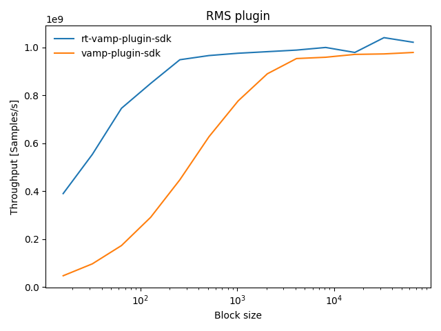
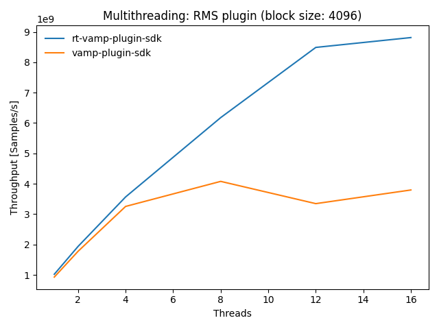

# Real-time Vamp plugin SDK for C++20

[](https://opensource.org/licenses/MIT)
[](https://github.com/lukasberbuer/rt-vamp-plugin-sdk/actions/workflows/ci.yml)
[](https://github.com/lukasberbuer/rt-vamp-plugin-sdk/actions/workflows/doc.yml)
[](https://github.com/lukasberbuer/rt-vamp-plugin-sdk/actions/workflows/python.yml)
[](https://coveralls.io/github/lukasberbuer/rt-vamp-plugin-sdk)
[](https://pypi.org/project/rtvamp)
[](https://pypi.org/project/rtvamp)

Vamp is an C/C++ plugin API for audio analysis / feature extraction plugins: https://www.vamp-plugins.org

This SDK for plugins and hosts targets performance-critical applications by:

- reducing memory allocations, **no memory allocation** during processing
- simplifying and restricting the plugin API
- `constexpr` evaluation for compile time errors instead of runtime errors

The SDK aims to be **well tested**, **cross-platform** and use **modern C++**.
The plugin SDK is available as a [single-header library](https://github.com/lukasberbuer/rt-vamp-plugin-sdk/releases/latest/download/pluginsdk.hpp) (download as asset from [latest release](https://github.com/lukasberbuer/rt-vamp-plugin-sdk/releases/latest) page).

Compiler support: `GCC >= 10`, `Clang >= 11`, `MSVC >= 19.30`

> **Note**:
> Python bindings for the hostsdk are available via [PyPI](https://pypi.org/project/rtvamp).
> Please check out the [documentation](https://lukasberbuer.github.io/rt-vamp-plugin-sdk/python).

## Links

- [API documentation](https://lukasberbuer.github.io/rt-vamp-plugin-sdk)
- [Examples](https://github.com/lukasberbuer/rt-vamp-plugin-sdk/tree/master/examples)
- Vamp ecosystem:
    - [Great collection of plugins](https://www.vamp-plugins.org/download.html)
    - [Sonic Visualiser](https://www.sonicvisualiser.org/): Open-source software to visualize, analyze and annotate audio
    - [Sonic Annotator](https://vamp-plugins.org/sonic-annotator/): Batch tool for feature extraction
    - [Audacity supports Vamp plugins](https://wiki.audacityteam.org/wiki/Vamp_Plug-ins)

## Performance

Following benchmarks compare the performance/overhead of the plugin SDKs based on a simple [RMS plugin](https://github.com/lukasberbuer/rt-vamp-plugin-sdk/tree/master/benchmarks/sdks/RMS.hpp).
The performance is measured as throughput (number of processed samples per second).

**Results with an i7-9850H CPU (12 cores):**

| Throughput vs. block size                          | Multithreading                                                    |
| -------------------------------------------------- | ----------------------------------------------------------------- |
|  |  |

**Results with an ARMv7 CPU**:
[Throughput vs block size](https://github.com/lukasberbuer/rt-vamp-plugin-sdk/tree/master/benchmarks/sdks/results/benchmark_sdks_armv7.png),
[Multithreading](https://github.com/lukasberbuer/rt-vamp-plugin-sdk/tree/master/benchmarks/sdks/results/benchmark_sdks_armv7_multithreading.png)

## Why another SDK?

The [official SDK](https://github.com/c4dm/vamp-plugin-sdk) offers a convenient [C++ plugin interface](https://code.soundsoftware.ac.uk/projects/vamp-plugin-sdk/embedded/classVamp_1_1Plugin.html).
But there are some drawbacks for real-time processing:

- Huge amount of memory allocations due to the use of C++ containers like vectors and lists **passed by value**.

  Let's have a look at the `process` method of the `Vamp::Plugin` class which does the main work:

  `FeatureSet process(const float *const *inputBuffers, RealTime timestamp)`

  `FeatureSet` is returned by value and is a `std::map<int, FeatureList>`.
  `FeatureList` is a `std::vector<Feature>` and `Feature` is `struct` containing the actual feature values as a `std::vector<float>`.
  So in total, those are three nested containers, which are all heap allocated.

- The C++ API is a wrapper of the C API:

  On the plugin side, the `PluginAdapter` class converts the C++ containers to C level ([code](https://github.com/c4dm/vamp-plugin-sdk/blob/master/src/vamp-sdk/PluginAdapter.cpp#L828-L921)).
Therefore the C++ containers are temporary objects and will be deallocated shortly after creation.

  On the host side, the `PluginHostAdapter` converts again from the C to the C++ representation ([code](https://github.com/c4dm/vamp-plugin-sdk/blob/master/src/vamp-hostsdk/PluginHostAdapter.cpp#L413-L464)).

### Solution approach

The `rt-vamp-plugin-sdk` aims to to keep the overhead minimal but still provide an easy and safe to use API:

1. Static plugin informations are provided as `static constexpr` variables to generate the C plugin descriptor at compile time.
2. The computed features are returned by reference (as a `std::span`) to prevent heap allocations during processing.
3. The input buffer is provided either as a `TimeDomainBuffer` (`std::span<const float>`) or a `FrequencyDomainBuffer` (`std::span<const std::complex<float>>`).
   The process method takes a `std::variant<TimeDomainBuffer, FrequencyDomainBuffer>`. A wrong input buffer type will result in an exception. The sized spans enable easy iteration over the input buffer data.

### Plugin restrictions

Following features of the Vamp API `Vamp::Plugin` are restricted within the `rt-vamp-plugin-sdk`:

- `OutputDescriptor::hasFixedBinCount == true` for every output.
  The number of values is constant for each feature during processing.
  This has the advantage, that memory for the feature vector can be preallocated.

- `OutputDescriptor::SampleType == OneSamplePerStep` for every output.
  The plugin will generate one feature set for each input block.
  
  Following parameters are therefore negitable:
  - `OutputDescriptor::sampleRate`
  - `OutputDescriptor::hasDuration`
  - `Feature::hasTimestamp` & `Feature::timestamp`
  - `Feature::hasDuration` & `Feature::duration`

- Only one input channel allowed: `getMinChannelCount() == 1`

## Minimal example

More examples can be found here: https://github.com/lukasberbuer/rt-vamp-plugin-sdk/tree/master/examples.

### Plugin

```cpp
class ZeroCrossing : public rtvamp::pluginsdk::Plugin<1 /* one output */> {
public:
    using Plugin::Plugin;  // inherit constructor

    static constexpr Meta meta{
        .identifier    = "zerocrossing",
        .name          = "Zero crossings",
        .description   = "Detect and count zero crossings",
        .maker         = "LB",
        .copyright     = "MIT",
        .pluginVersion = 1,
        .inputDomain   = InputDomain::Time,
    };

    OutputList getOutputDescriptors() const override {
        return {
            OutputDescriptor{
                .identifier  = "counts",
                .name        = "Zero crossing counts",
                .description = "The number of zero crossing points per processing block",
                .unit        = "",
                .binCount    = 1,
            },
        };
    }

    bool initialise(uint32_t stepSize, uint32_t blockSize) override {
        initialiseFeatureSet();  // automatically resizes feature set to number of outputs and bins
        return true;
    }

    void reset() override {
        previousSample_ = 0.0f;
    }

    const FeatureSet& process(InputBuffer buffer, uint64_t nsec) override {
        const auto signal = std::get<TimeDomainBuffer>(buffer);

        size_t crossings   = 0;
        bool   wasPositive = (previousSample_ >= 0.0f);

        for (const auto& sample : signal) {
            const bool isPositive = (sample >= 0.0f);
            crossings += int(isPositive != wasPositive);
            wasPositive = isPositive;
        }

        previousSample_ = signal.back();

        auto& result = getFeatureSet();
        result[0][0] = crossings;  // first and only output, first and only bin
        return result;             // return span/view of the results
    }

private:
    float previousSample_ = 0.0f;
};

RTVAMP_ENTRY_POINT(ZeroCrossing)
```

### Host

```cpp
// list all plugins keys (library:plugin)
for (auto&& key : rtvamp::hostsdk::listPlugins()) {
    std::cout << key.get() << std::endl;
}

auto plugin = rtvamp::hostsdk::loadPlugin("minimal-plugin:zerocrossing", 48000 /* samplerate */);
plugin->initialise(4096 /* step size */, 4096 /* block size */);

std::vector<float> buffer(4096);
// fill buffer with data from audio file, sound card, ...

auto features = plugin->process(buffer, 0 /* timestamp nanoseconds */);
std::cout << "Zero crossings: " << features[0][0] << std::endl;
```
